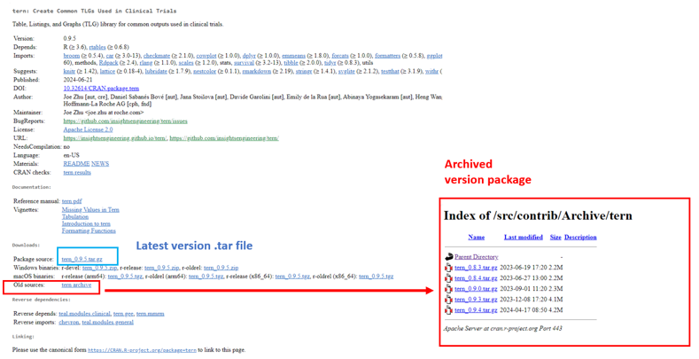

# Get package host

## Overview

This vignette demonstrates how to use a set of R functions to
programmatically retrieve the URL and code host package hosted on CRAN,
Bioconductor and Github.

We will walk through each step, from checking if a package exists on
CRAN to fetching its version history and constructing an appropriate
download URL.

## CRAN

``` r
library(DT)
```

    ## Warning: package 'DT' was built under R version 4.2.3

``` r
library(risk.assessr)
```

### Check if the Package Exists on CRAN

``` r
risk.assessr:::check_cran_package("here")
```

### Parse Package Archive HTML from CRAN database

fetch information from
“<https://cran.r-project.org/src/contrib/Archive/here/>”

``` r
html <- risk.assessr:::parse_package_info("here")
html
```



### Extract Version Information from the Archive Page

Create table with `package_name`, `package_version`, `link`, `date`,
`size` from CRAN website

### Get All Versions and the Latest Version

``` r
version_info <- risk.assessr:::get_versions(table, "here")
version_info$last_version
```

### Get CRAN package URL source code

``` r
url <- risk.assessr:::get_cran_package_url(
  package_name = "here",
  version = NULL,
  last_version = version_info$last_version,
  all_versions = version_info$all_versions
)
url
```

## Internal R package

`risk.assessr` can also provide similar information from Internal mirror

``` r
result_intern <- risk.assessr:::get_internal_package_url("herald")
```

``` r
result_intern$url
```

``` r
result_intern$last_version
```

## Bioconductor package

Steps to get an R package stored on Bioconductor

``` r
html_content <- fetch_bioconductor_releases()
release_data <- parse_bioconductor_releases(html_content)
result_bio <- get_bioconductor_package_url("flowCore", "2.18.0", release_data)
```

``` r
result_bio$url
```

## Github repository

R packages stored on Github are assess by looking at BugReports or URL
in DESCRIPTION file to find a owner. github link are then created such
as below and used to request Github API.

``` r
urls <- c(
  "https://github.com/tidyverse/ggplot2"
)
bug_reports <- c(
  "https://github.com/tidyverse/ggplot2/issues"
)

all_links <- c(urls, bug_reports)

github_pattern <- "https://github.com/([^/]+)/([^/]+).*"
matching_links <- grep(github_pattern, all_links, value = TRUE)
owner_names <- sub(github_pattern, "\\1", matching_links)
package_names_github <- sub(github_pattern, "\\2", matching_links)

valid <- which(owner_names != "" & package_names_github != "")

  if (length(valid) > 0) {
    github_links <- unique(paste0("https://github.com/", owner_names[valid], "/", package_names_github[valid]))
  } else {
    github_links <- NULL
  }

github_links
```

## Get R package source code

``` r
tarball_path <- get_package_tarfile("dplyr", version = "1.0.0")
```

    ## Checking dplyr in configured repositories...

    ## Trying https://cran.rstudio.com/

    ## Package tarball saved at: C:\Users\I0555262\AppData\Local\Temp\RtmpKa3kbi\file74c014db7948
